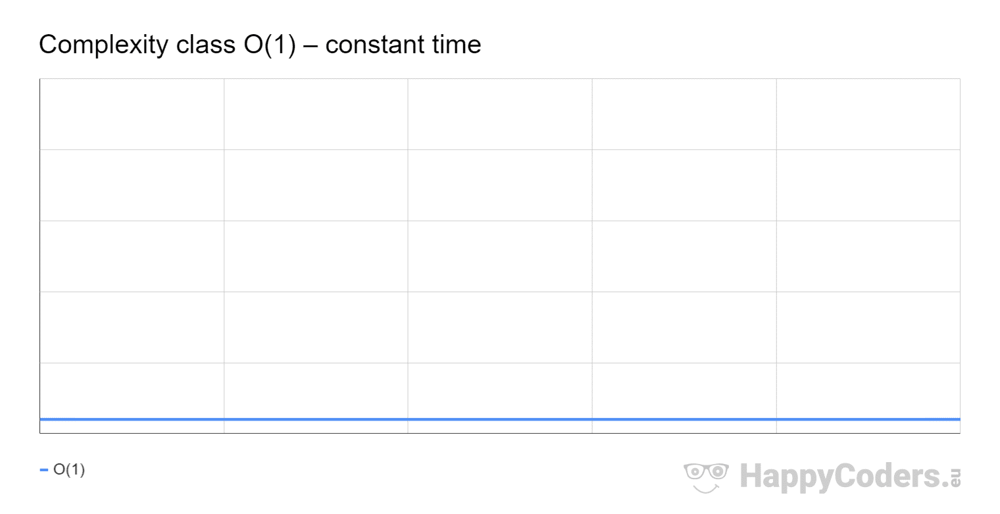

<h1>Big-O Notation</h1>

The first principle to understand with data structures is efficiency. Have you ever opened a program and it takes forever to load? It can be infuriating. Where a slow program can be an irritant to a customer it can be a deal breaker when it comes to clients or huge systems.
  

    x = 10
    y = 5
        print(str(x + y))
 

 The algorithm above has a Big-O notation of O(1). Big-O notation is what we refer to when we are talking about time or space efficiency.

 
<h2>O of 1</h2>

There are many notations of Big-O but for now we will focus on the best time efficiency which is O(1) which means your program is the most efficient in time or it is the most efficient with memory. Below we can use this graph to show an example.

 

If all programs could achieve this runtime we would have no load times or delays in programs, however when dealing with large amounts of data sometimes the most efficient time to achieve is a very slow runtime.

 
<h2>Big - O</h2>

The graph blow shows most of the other Big-O notation, as the line deviates from the x axis the program becomes more and more inefficient. 

 
 

The following algorithm below is a for loop. For loops tend to have a big O of N which means that the loop is as fast as the amount of data inserted into it. 

 

    for in blue:
        print('blue')
 

Let us try some practice if the big O of the previous problem was O(n) what do you think this one would be?

    for in blue:
        for in red:
            print('moo')

 first let us remember that one loop was O(n) if we take that n and multiply it by another n we get n2 which if you look aat our previous graph is a very ineficient in time or space since we need to loop through the first loop once but then loop through the second one however many times the size of data.

 

Watch the following video to review what we have gone over. <a href = 'https://www.youtube.com/watch?v=__vX2sjlpXU'>Introduction to Big-O</a>. 
 

When you are done try to solve the following big-O practice down below.

    x = 5
    y = 2
    print(str(x + y))

 

    for i in blue:
        print('moo')

 

    for i in blue:
        for y in red:
            print('moo')

 

    for i in blue:
        for y in red:
            for z in green:
                print('moo')

hint: The last one is worse case.
 

    import itertools
    a_list = [1, 2, 3]

    permutations_object = itertools.permutations(a_list)
    permutations_list = list(permutations_object)

    print(permutations_list)

