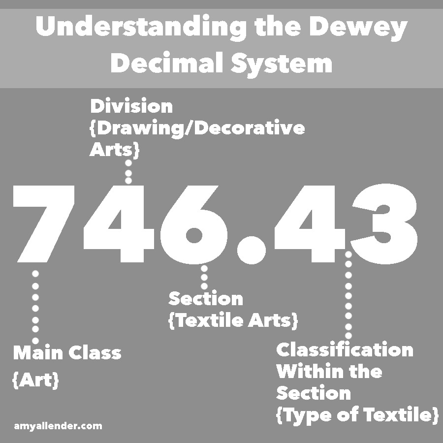

<h1>Sets</h1>

Sets are used to store multiple items in a single variable. they are very similar to lists, however they are unordered and they cannot have duplicates. What makes them more appealing than say a list is the time complexity.

    list = [5, 6, 6]

How would you go about itterating through this list? A simple solution would be a for loop where you start from the begining and look for what number you want, however we have a few problems with this method.

    for i in list:
        if i == 6:
            print(i)

first what if we have duplicates? We will print the first item that meets our perameters. second what if the list is 10000000000000 characters long? Remember a for loop has Big O of N meaning that it would take 10000000000000 in time complexity or space complexity which is unprefered and even in some cases unusable. 

What is so cool about a set is while they are similar to a list they are more like a phone book. Rather than looking for Z by starting at the begining, you know the letter therefore you would start near the end. To understand this concept we need to understand hashing.

<h2>Hashing</h2>

Hashing is when you transform a key or a string of characters into another value. One of the most popular forms of hashing is the implementation of hashing tables. A hash table stores the keys and the value pairs in a list that is accesable through the index.
The key value pairs are unlimited therefore the hash function maps the keys to the tables size. Then the hash value becomes the index for a specific element.

A real world example would be the Dewey Decimal system.

We have a main key, a subclass key and a section key. Then we have a clasification. When someone is looking for data or an item these numbers narrows the search, the same way hashing does for data that we need to find. 

<h2>Examples</h2>

Time for some examples and practice.

    set = {'moo', 'fish', 'cheese'}
    print(set)

    {'moo', 'fish', 'cheese'}

Similare to a list a set can contain strings, integers, floats, and other data types. Including other sets making it a sort of subset.

