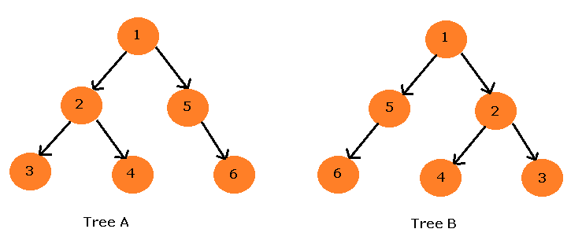
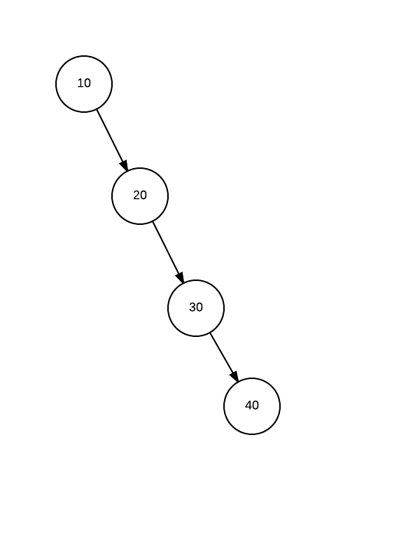

<h1>Trees</h1>

The last data structure is reffered to as a tree. There are many different trees however we will focus on the principle rather than a specific type of tree data structure. 

First What is a tree? A tree is a non linear data structure. If you compare it to an array, linked list, or stacks and queues, you will find that it can be empty with no nodes or it consists of one node called the root and zero or one or more subtrees.

<h2>Components of Trees</h2>

We need to break down trees into the components that it is made up of. The first part is something refered to as a node. A node is a basic unit of a data structure. They contain data and can be linked to other nodes. They are usually linked by pointers.

The root node is the top node or the bottom node in a tree data structure depending on how the tree is represented. It is reffered to as a tree because of it's representation of a root starting point and branching out nodes. 

The parent node is a node that has a left right node and a data element. Each node can be connect to an arbitrary number of nodes which are called children. Nodes with no children are called leaves or they are also reffered to as external nodes. the last part is refered to as siblings, which are nodes on the same level with the same parent.

<h2>Unorderded vs ordered Trees</h2>

An ordered tree has its subtrees in a particular order and the squence of the subtree annot contain the same tree twice because the subtrees need to be disjointed.

Tree A is ordered, tree B is unordered. The following is an example of a Binary search tree and how it works in a real world aspect. <a href="https://www.youtube.com/watch?v=KXJSjte_OAI">Binary search tree</a>

Below is an example of a tree organized like a list. Its unordered, and remember that trees are connected by nodes with pointers, this means that the nodes are not together in memory, they are all over the place. And if you don't order your tree you don't have the benefits of a fast search.

 

<h2>Time Complexity</h2>

What takes time and resources for trees is ording them. However once they are ordered there are few systems faster and more precise. However if it is unordered then it is treated no different than a linear array and you must parse through each point of data making it O(n) to find and delete an item, however if it is ordered you can do a simple check just like in the video, is what we are looking for smaller than what is in the moddle, yes then get rid of everything bigger than what is in the middle. Then go into the middle of what is left and repeat.

